<div align="center">


<h1>Application Landing Zone (ALZ)</h1>

<p><strong>The Golden Path Foundation for Launching Secure, Standardized, and Compliant Cloud Applications</strong></p>

[](https://devopstrio.co.uk/)
[](/terraform)
[](/apps/governance-engine)
[](https://devopstrio.co.uk/)

</div>

---

## 🏛️ Executive Summary

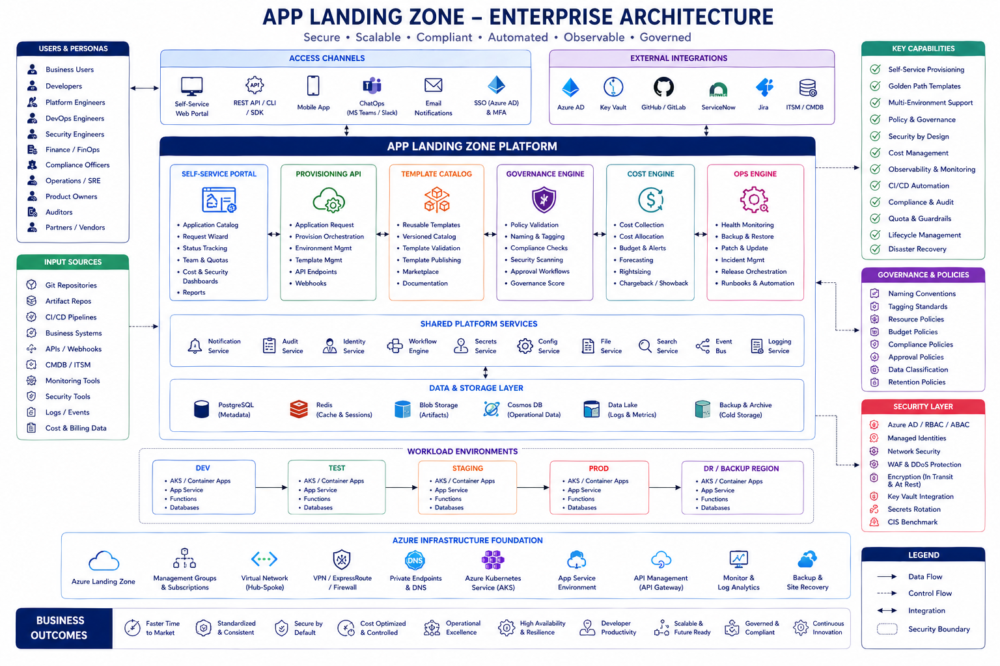

The **Application Landing Zone (ALZ)** is the central developer platform engineered to accelerate the delivery of modern microservices, web apps, and API backends. Acting as an Internal Developer Portal (IDP), it abstracts away brutal infrastructure complexity by providing pre-vetted "Golden Path Templates."

### Strategic Business Outcomes
- **"Day 1" Productivity**: Developers provision fully compliant Dev, Test, and Prod application environments in under 5 minutes.
- **Security by Default**: All workloads are deployed behind Azure Front Door WAFs, bounded by Private Link, and integrated with Key Vaults.
- **FinOps Observability**: The embedded Cost Engine assigns hard quotas and predicts chargebacks at the application-namespace level.
- **Automated Governance**: Infrastructure drift and tagging non-conformities are caught dynamically during the provisioning pipelines.

---

## 🏗️ Technical Architecture Details

### 1. High-Level App Provisioning Flow
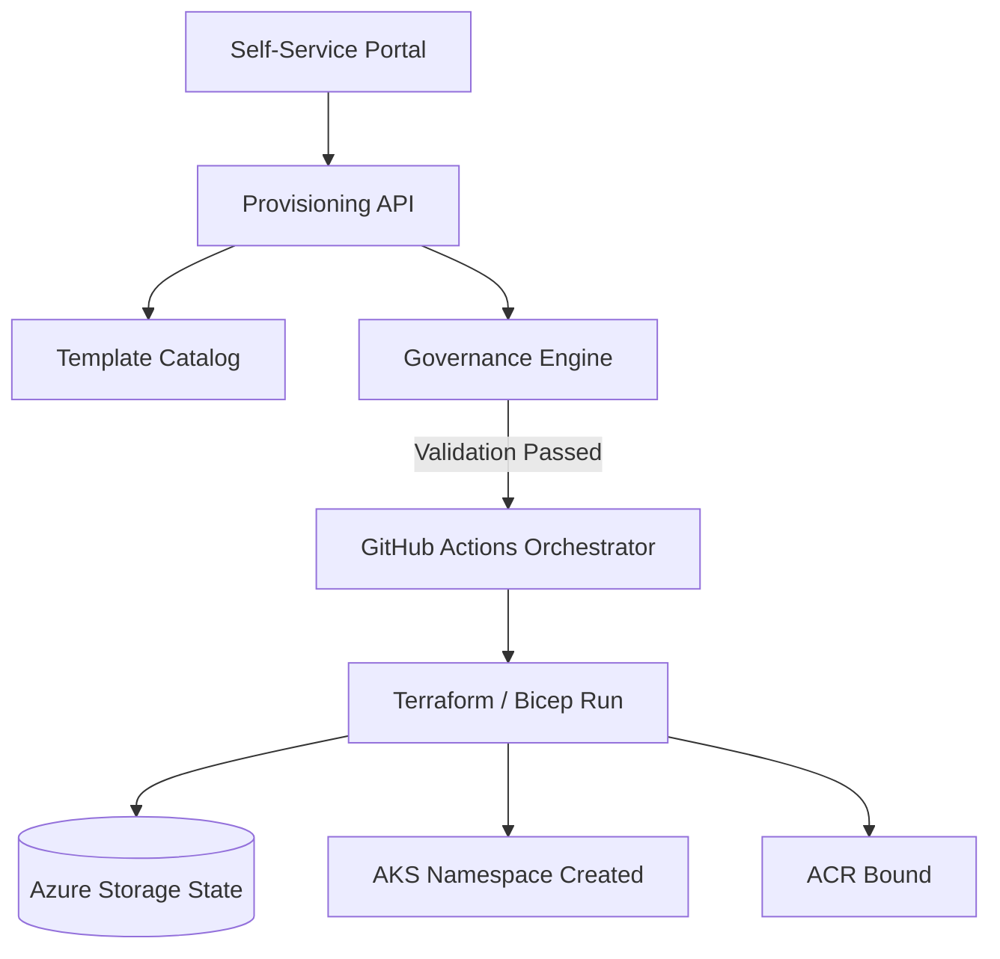

### 2. Multi-Environment Promotion Lifecycle
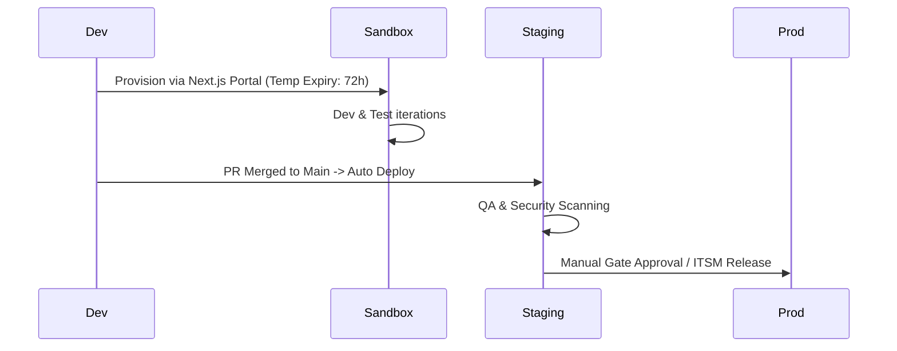

### 3. Golden Template Architecture
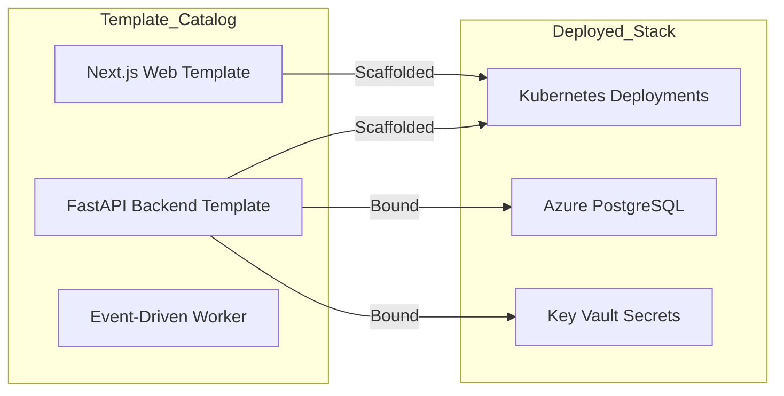

### 4. Governance Validation Flow
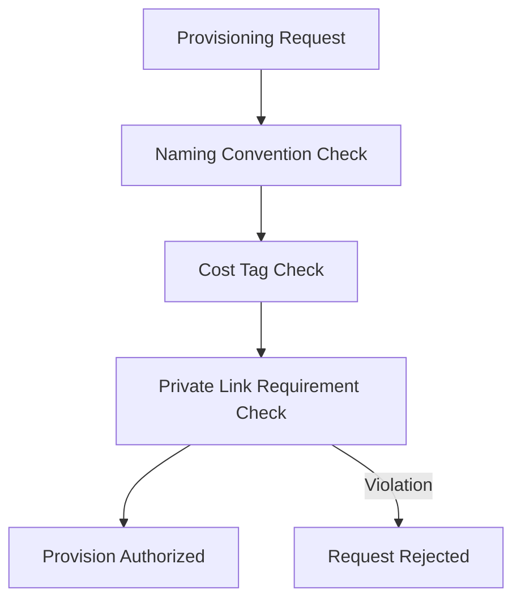

### 5. Cost Optimization Engine
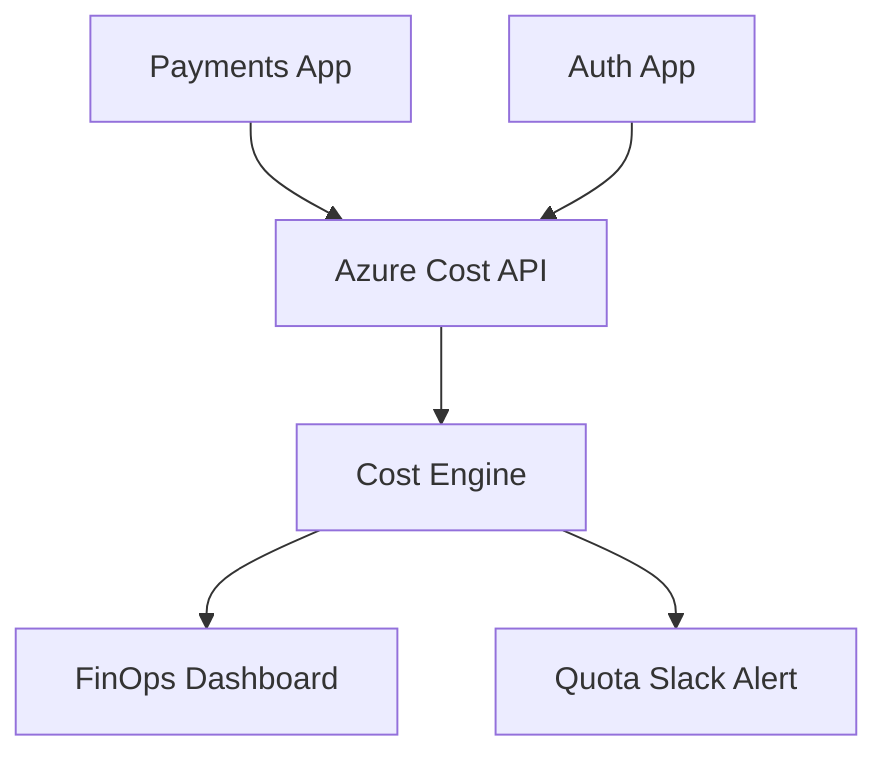

### 6. Security Trust Boundary
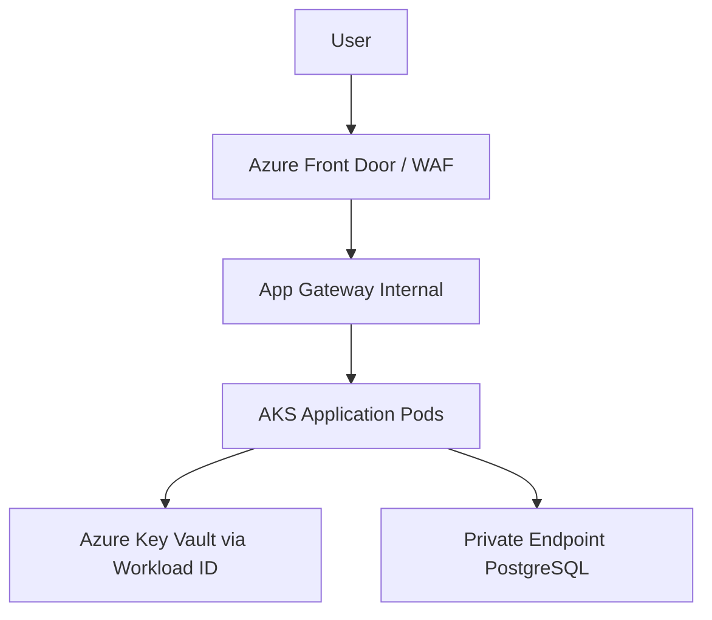

### 7. AKS Workload Topology
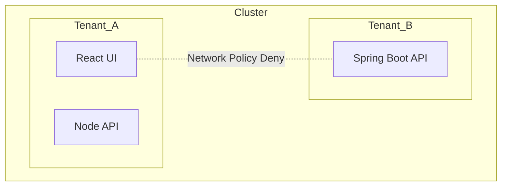

### 8. API Request Lifecycle
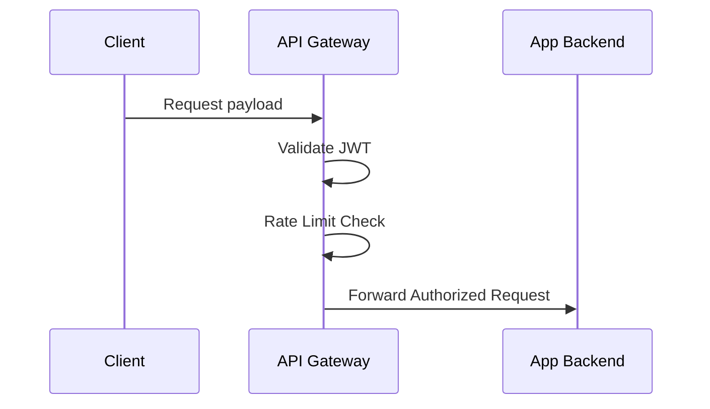

### 9. Multi-Tenant Model
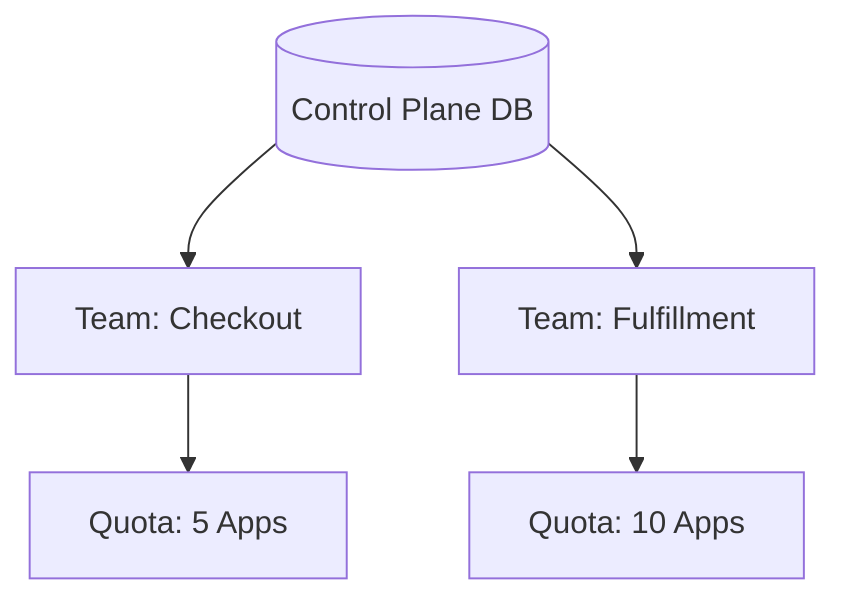

### 10. Centralized Logging & Monitoring
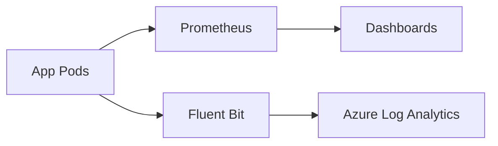

### 11. CI/CD CI/CD Pipeline
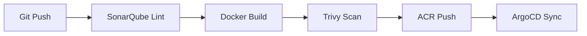

### 12. Disaster Recovery Topology
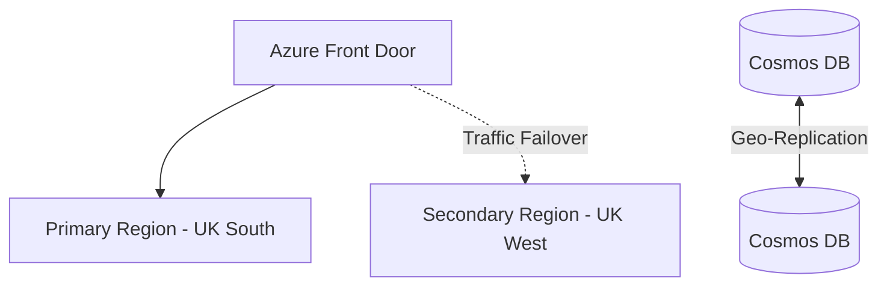

### 13. Developer Onboarding
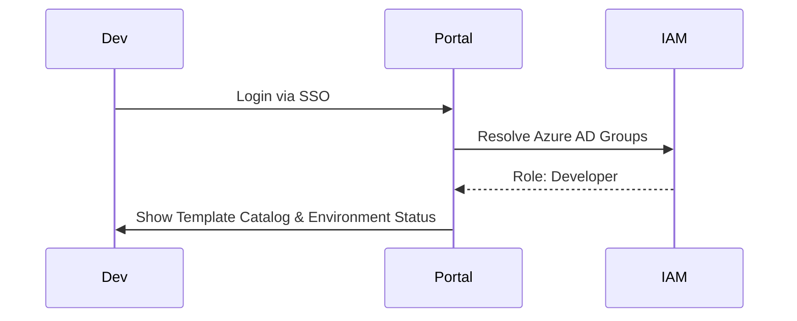

### 14. Template Publishing Flow
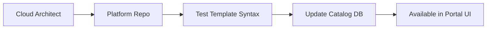

### 15. Operational Auto-Remediation
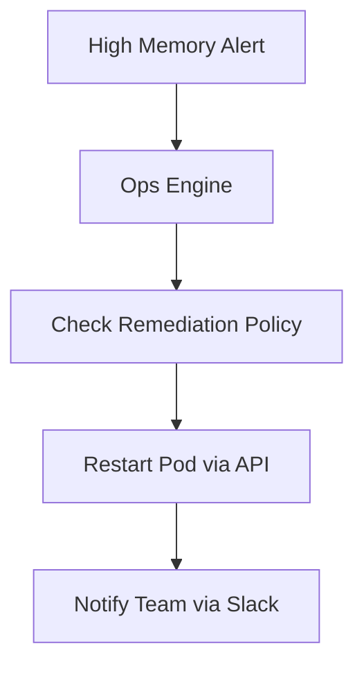

---

## 🛠️ Global Platform Engines

| Engine | Directory | Purpose |
|:---|:---|:---|
| **Self-Service Portal** | `apps/portal/` | The Next.js developer interface. |
| **Provisioning API** | `apps/provisioning-api/` | FastAPI orchestration engine for IaC automation. |
| **Governance Engine** | `apps/governance-engine/`| Enforces tags, naming, and architectural validations. |
| **Cost Engine** | `apps/cost-engine/` | Aggregates application spend and predicts budget burn. |
| **Template Catalog** | `apps/template-catalog/` | Versioned store of "Golden" application topologies. |
| **Ops Engine** | `apps/ops-engine/` | Automates health checks, restarts, and routine maintenance. |

---

## 🚀 Environment Bootstrapping

Deploy the foundation infrastructure to establish the overarching Application Landing Zone environments.

```bash
cd terraform/environments/prod
terraform init
terraform apply -auto-approve
```

---
<sub>&copy; 2026 Devopstrio &mdash; Standardizing the Application Enterprise.</sub>
